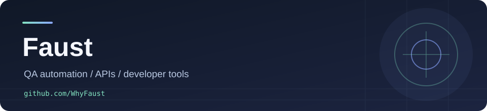

  

<h3 align="center">Build useful things. Keep the boundaries clear.</h3>

  QA automation engineer · Python · integrations · tools for developers

  <a href="https://github.com/WhyFaust?tab=repositories">Projects</a> ·
  <a href="https://t.me/WhyFaust_tv">Telegram</a>

---

Hi, I'm **Faust**. I work in test automation and build practical tools around APIs, local developer workflows and game servers. Here are three places to start:

### What I'm building

| | Project | Why it exists |
| :--- | :--- | :--- |
| 🔗 | **[threads-mcp](https://github.com/WhyFaust/threads-mcp)** | A standalone MCP server for the official Meta Threads API — read analytics and recent posts, with guarded publishing. |
| ◉ | **[codex-quota-widget](https://github.com/WhyFaust/codex-quota-widget)** | A GNOME Shell 46 panel indicator for quota reported by a local Codex app-server. |
| ⚙️ | **[Guild](https://github.com/WhyFaust/Guild)** | A Counter-Strike server plugin in C#. |

More projects

My [repositories](https://github.com/WhyFaust?tab=repositories) also include game-server plugins and smaller experiments. Each project README is the source of truth for what it actually supports.

---

Привет! Пишу про разработку, автоматизацию и то, что действительно удалось проверить — <a href="https://t.me/WhyFaust_tv">@WhyFaust_tv</a>.

