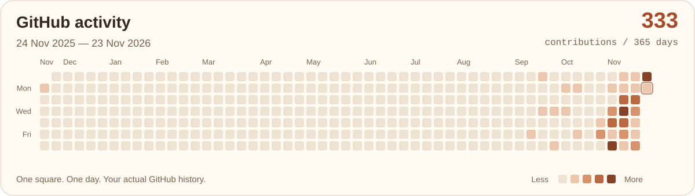

<picture>
  <source media="(prefers-color-scheme: dark)" srcset="https://raw.githubusercontent.com/WhyFaust/WhyFaust/main/assets/generated/hero-dark.svg?v=b719ca01fd41">
  
</picture>

  <a href="https://t.me/WhyFaust_tv">
<picture>
  <source media="(prefers-color-scheme: dark)" srcset="https://raw.githubusercontent.com/WhyFaust/WhyFaust/main/assets/generated/telegram-dark.svg?v=e33a263fa79d">
  
</picture>
  </a>
  <a href="https://github.com/WhyFaust?tab=repositories">
<picture>
  <source media="(prefers-color-scheme: dark)" srcset="https://raw.githubusercontent.com/WhyFaust/WhyFaust/main/assets/generated/repositories-dark.svg?v=6701a753dcbd">
  
</picture>
  </a>

## Currently building

Latest original public projects, automatically selected from GitHub.

<a href="https://github.com/WhyFaust/fmem">
<picture>
  <source media="(prefers-color-scheme: dark)" srcset="https://raw.githubusercontent.com/WhyFaust/WhyFaust/main/assets/generated/project-1-dark.svg?v=678dfbf95ac9">
  
</picture>
</a>

<a href="https://github.com/WhyFaust/fstack">
<picture>
  <source media="(prefers-color-scheme: dark)" srcset="https://raw.githubusercontent.com/WhyFaust/WhyFaust/main/assets/generated/project-2-dark.svg?v=7ed54c636c6a">
  
</picture>
</a>

<a href="https://github.com/WhyFaust/threads-mcp">
<picture>
  <source media="(prefers-color-scheme: dark)" srcset="https://raw.githubusercontent.com/WhyFaust/WhyFaust/main/assets/generated/project-3-dark.svg?v=629070b52584">
  
</picture>
</a>

<a href="https://github.com/WhyFaust/codex-quota-widget">
<picture>
  <source media="(prefers-color-scheme: dark)" srcset="https://raw.githubusercontent.com/WhyFaust/WhyFaust/main/assets/generated/project-4-dark.svg?v=1758ea2f150e">
  
</picture>
</a>

## A year on GitHub

<picture>
  <source media="(prefers-color-scheme: dark)" srcset="https://raw.githubusercontent.com/WhyFaust/WhyFaust/main/assets/generated/activity-dark.svg?v=b8764a8adb57">
  
</picture>

  <a href="https://t.me/WhyFaust_tv">AI, Python, development &amp; games — @WhyFaust_tv</a>

  From GitHub, automatically. Snapshot changed 23 Nov 2026, 00:32 UTC. 
  <a href="https://github.com/WhyFaust/WhyFaust/actions/workflows/update-profile.yml">Refreshes on a 5-minute schedule</a> · GitHub may delay updates.

